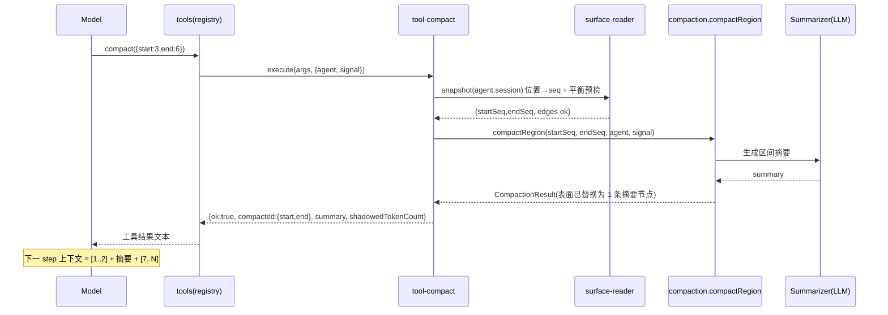

# 设计:局部上下文压缩工具(compact / compact_inspect)

> 状态:已完成(阶段一:动态插件验证通过);阶段二(固化)待批准
> 创建:2026-08-31  更新:2026-08-31
> 版本基线:契约按 **dsh 0.1.2-alpha.2**(ebf017b61addb8bd)核对;rc 0.1.1-rc.2 与 alpha 在 compaction/tools/session 契约上一致,但 `harness.defineTool` 的参数 schema DSL 有差异(见 §5)。固化阶段前需在当时运行时上复核。

## 1. 目标与范围

### 目标

提供模型可调用的工具 `compact(start, end)`:把当前会话"对话消息表面"中第 `start` 到第 `end` 条消息(1-based,含两端)总结为一条摘要节点并原位替换,之后模型看到的上下文为 `[1..start-1] + 摘要 + [end+1..N]`。另提供只读辅助工具 `compact_inspect`,实时列出表面每条消息的真实位置、角色、预览与"能否作为压缩起点/终点"标记,让调用方照单填数、不靠猜。

### 范围外(显式排除)

- **不改 system prompt / 工具描述**:它们由 prompt assembly 每次 step 动态组装,不在可压缩的会话表面内,也没有稳定编号。
- **不做自动触发**:运行时已有 pressure / context-overflow 自动压缩策略,不动它。
- **不做用户侧命令**:`/compact` 命令已存在(整段压缩、要求 agent 空闲);区域压缩命令需要 idle 语义,不在本次范围。
- **不新增持久化存储**:工具无状态,一切状态都在 session 日志与 surface 里。
- **首版不接受"自定义摘要文本"参数**:摘要由运行时 summarizer 生成,保持接口最小。

### 交付策略(用户已确认)

两阶段:先以**动态 Cordis 插件**(Host-only)在当前进程跑通并验证;验证通过后再**固化为持久插件**。本设计完整定义阶段一;阶段二只给方向与验收标准,细节在验证后另行设计。

## 2. 模块划分

阶段一为单 Host Package(`code.host` 内按函数分组),模块边界如下:

| 模块 | 一句话职责 | 关键类型 | 允许依赖 |
|---|---|---|---|
| `surface-reader` | 从 `agent.session` 只读投影表面快照:位置→seq、角色/种类、预览、切割平衡标记,corrupt 时降级不抛 | `PositionView`, `SurfaceSnapshot` | 仅 `Session`(`session.surface.nodes`、`session.events`) |
| `tool-compact` | `compact` 工具的 schema/output/execute:参数校验 → 位置转 seq → 调 `compaction.compactRegion` → 规范化结果 | `CompactArgs {start,end}`, `CompactResult` | `surface-reader`(平衡预检)、`compaction` Service、`exec.signal` |
| `tool-inspect` | `compact_inspect` 工具的 schema/output/execute:返回 `surface-reader` 的只读视图(带窗口截断) | `InspectResult` | `surface-reader` |
| `register` | 装配:探测 `compaction` Service、经 `harness.defineTool` 构造并 `harness.registerTool` 注册两个工具、生命周期清理 | — | `ctx.get` / `harness`、以上三模块 |

依赖方向单向无环:

```
register → tool-compact ─┐
        → tool-inspect ──┼→ surface-reader → Session(surface/events)
        → compaction Service(运行时已有,只调不拥有)
```

Client 无代码。`compaction` 缺席时(可选依赖 `ctx.get('compaction') === undefined`),`register` 不注册任何工具并记一条日志,插件保持无害。

## 3. 公共接口契约(先签名,后实现)

### 3.1 工具 `compact`

**注册名**:`compact`,经 `harness.defineTool` 构造后 `harness.registerTool(ctx, tool)` 注册。

模型可见 schema(alpha DSL 约束:根对象 `additionalProperties` 必须省略或为 true;**不支持 `minimum`/`maximum` 关键字**,数值边界在 execute 内校验):

```json
{
  "name": "compact",
  "description": "Compress a range of the current conversation surface into one summary message. Positions are 1-based surface positions over the message list (system prompt and tool descriptions are NOT part of this list). Call compact_inspect first to read the real positions and valid boundaries. Both edges must be tool-pairing balanced: no assistant tool call may cross the cut before `start` or after `end`. The last surface position during this call is your own assistant tool-call message and can never be part of the range (its trailing edge is unbalanced), so `end` must be at most the position before it.",
  "parameters": {
    "type": "object",
    "properties": {
      "start": { "type": "integer", "description": "First surface position to compact, inclusive (1-based)." },
      "end": { "type": "integer", "description": "Last surface position to compact, inclusive (1-based)." }
    },
    "required": ["start", "end"]
  }
}
```

`execute(args, exec)` 行为约定(签名先于实现;所有错误路径返回结构化结果,不抛异常逃逸):

| 步骤 | 条件 | 结果 |
|---|---|---|
| 1 | `exec.agent` 为 `undefined` | `{ok:false, category:'invalid', error:'compact requires an agent context'}` |
| 2 | `start`/`end` 非整数、`<1`、`end < start` | `{ok:false, category:'invalid', error:'invalid range: …'}` |
| 3 | 位置越界(> 表面长度) | `{ok:false, category:'invalid', error:'position N beyond surface (length M); run compact_inspect first'}` |
| 4 | 切割不平衡(见 3.3) | `{ok:false, category:'invalid', error:'start/end position N is not a balanced boundary: …'}` |
| 5 | 位置→seq 映射后调 `compaction.compactRegion(startSeq, endSeq, agent, exec.signal)` | 见下 |

成功结果(从 `CompactionResult` 只提取模型需要的叶子,字段名以 alpha 契约为准):

```
{ ok:true, compacted:{start,end}, summary:<string>, shadowedTokenCount:<number> }
```

- `summary` 从 `result.summary`(ContentBlock[])抽取全部 text block 拼接;`shadowedTokenCount` 是被替换段的估计 token 数。
- **不暴露** `shadowedRange`/`shadowedSeqs`(engine 内部 seq,且替换后 seq 可非单调,对模型无意义)与 `startSeq/summarySeq/endSeq/compactionId`。
- **无** `tokenBefore/tokenAfter`:运行时不提供该口径;若后续需要,阶段二在调用前后各测一次 `tokenMeter.measure(session)`(开放问题)。

失败结果(engine 抛错,统一归一化):

```
{ ok:false, category, error, hint? }
```

`category` 取值与处置:`invalid`(预检失败,先 compact_inspect)、`busy`(会话内存在未闭合的 compaction 锁,durable lock,**重试无效**,直到新会话生命周期)、`changed`(压缩期间表面被并发修改,**可重试**)、`cancelled`、`summary`(摘要未更小或 summarization 失败,**改选更小区间重试**)、`commit` / `persistence`、`other`。`error` 文本:插件侧预检路径一律用 1-based 位置表述,不泄露 seq;engine 原错误(含 seq 字样的诊断)仅作为 `error` 字符串透传,不另设字段。engine 校验顺序为 validate(含平衡)→ 锁 → open turn,插件预检不能替代它(TOCTOU),仅作 advisory。

其他约定:

- **信号**:`exec.signal` 原样转发给 `compactRegion`。
- **并发**:不声明 `isConcurrencySafe` → 默认 exclusive,与 surface 变更互斥。
- **open turn**:`compactRegion` 以 `owner:'current-turn'` 执行,要求会话存在打开中的 turn——工具调用发生在 agent turn 内,天然满足;engine 抛 "no open turn" 时按 `category:'other'` 透传。
- **当前 step 禁区**:execute 执行时,表面最后一个节点是本 step 的 assistant 工具调用消息(含本次 `compact` 调用),其 trailing 切割不平衡 → 该节点永远不能进入区间(天然被平衡校验拒绝);压缩成功后本次调用与它的 `tool/result` 保留在表面尾部。
- **output 契约**:`output.schema` 为 `{type:'object'}`(只约束 execute 返回值为合法 JSON,经沙箱 JSON round-trip);`output.render` 渲染 1-2 段模型可读文本(成功:替换区间 + 摘要正文;失败:category + error + hint)。模型可见 schema 只有 name/description/parameters——`output.schema` 不是模型可见的。

### 3.2 工具 `compact_inspect`

**注册名**:`compact_inspect`(只读,无副作用)。

模型可见 schema:

```json
{
  "name": "compact_inspect",
  "description": "List the current conversation surface: 1-based positions, role, kind, preview, and whether each position can be a compaction start/end edge. Read-only. Call this before compact(start, end). By default shows the tail window when the surface is long; use from/to to inspect an older window.",
  "parameters": {
    "type": "object",
    "properties": {
      "from": { "type": "integer", "description": "Optional first position of the window to show, inclusive (1-based)." },
      "to": { "type": "integer", "description": "Optional last position of the window to show, inclusive (1-based)." }
    }
  }
}
```

`execute(args, exec)` 返回:

```json
{
  "ok": true,
  "length": 128,
  "omittedBefore": 78,
  "omittedAfter": 0,
  "corrupt": false,
  "positions": [
    { "pos": 79, "role": "user", "kind": "message", "preview": "把登录接口…", "canStartEdge": true, "canEndEdge": false },
    { "pos": 84, "role": "assistant", "kind": "tool_call", "toolNames": ["read"], "preview": "read(…)", "canStartEdge": false, "canEndEdge": false },
    { "pos": 85, "role": "user", "kind": "tool_result", "preview": "", "canStartEdge": false, "canEndEdge": true }
  ],
  "hint": "Valid compact(start,end) requires start<=end, canStartEdge[start]=true, canEndEdge[end]=true; call compact_inspect again after any successful compact (positions shift)."
}
```

- **窗口规则**:`from`/`to` 合法(整数、`1<=from<=to<=length`)时返回该窗口并填 `omittedBefore/omittedAfter`;未给或非法时,`length<=50` 返回全部,否则返回最后 50 条(tail window)。无效窗口返回 `{ok:false, category:'invalid', error:…}`,不回退默认窗口(显式参数报错,防止模型误读)。
- **`kind` 判定以 `event.type` 为准**(alpha `SurfaceEventType = 'user/message' | 'assistant/message' | 'tool/result'`):`message`(user/message)、`assistant`(assistant/message 无 tool_call block)、`tool_call`(assistant/message 含 tool_call block,附前 6 个 `toolNames`)、`tool_result`(tool/result)、`missing`(表面 seq 无对应事件 → `corrupt:true`)。
- **`role`** 仅作展示(user/assistant),判别不用 role(alpha 中 tool/result 的 message.role 也是 'user')。
- **`preview`**:取消息首个 text block,空白折叠,截 60 字符;无文本 block(如纯工具消息)为空串;忽略 image 等非文本 block。
- 序列尾部的说明:最后一个位置通常就是当前 step 的 assistant 工具调用(`canEndEdge:false`),正常现象。
- `exec.agent` 缺失时返回 `{ok:false, category:'invalid', error:…}` 同 3.1。

### 3.3 切割平衡规则(契约级定义,alpha 源码核对)

按**表面事件类型**折叠,维护 `open`(未配对工具调用数):

- `assistant/message` → `open += content 中 tool-call block 数`;
- `tool/result` → `open -= 1`(按事件计,不是按消息计);
- 其余(`user/message` 等)→ 0。

- 位置 `p` 的切割**前**平衡(`canStartEdge[p]`)⟺ 计入 `p` 之前 `open === 0`;
- 位置 `p` 的切割**后**平衡(`canEndEdge[p]`)⟺ 计入 `p` 之后 `open === 0`;
- `open < 0`(tool/result 无前置 call)⟺ 表面损坏:工具侧置 `corrupt:true`、`open` 归零、其后所有标记为 `false`,降级不抛。

该规则与 alpha 运行时 `toolPairingBalancedBefore/After`(`@deepseek-ai/dsh-compaction` 包级导出,不在 `ctx.compaction` 服务对象上)语义一致。双层防线:插件侧标记是**提示层**(advisory),`compactRegion` 校验是**权威层**(authoritative);双份实现的漂移风险由 §7 的对账验证项 + 阶段二直接复用运行时 helper 消除(决策 D4)。

### 3.4 压缩后的上下文形态

成功压缩后,模型下一 step 看到的表面为 `[1..start-1] + 新摘要节点(user 消息,携带 compact checkpoint source)+ [end+1..N]`;system prompt 与工具描述不受影响。注:"摘要必须小于被替换段"是 `dsh-compaction-basic` 的实现行为(不满足则抛错 → `category:'summary'`),**不是抽象契约**;换后端时工具不承诺结果更小。

## 4. 数据流 / 调用链

`compact(start, end)` 一次典型调用:



`compact_inspect` 只走 `surface-reader` 只读投影,不触达 `compaction`。

## 5. 依赖与配置变更

- **阶段一:零新增依赖**。复用运行时已有能力:`harness`(builtin)、`agentPresets` Service、Session 表面(`session.surface.nodes` / `session.events`)。不 `require` 任何包(动态插件代码无 import/require 转换,平衡计算在 `surface-reader` 内按 §3.3 自实现)。
- **alpha 架构事实(实测确认)**:web 部署中 `compaction-basic`/`command-compact`/`tool-result-pruner` 在 host 平面被 `disabled: true`,而由 agent preset 在 **`isolate` 域**内挂载(cordis 预设 `agent.cordis.yml` 的 `- id: compaction … isolate: {compaction: true}`)。isolate 域服务对域外(含 host 与动态插件)不可见——实测动态插件作用域内 `ctx.get('compaction') === undefined`,而同平面的 `tokenMeter/tools/fs/llm` 均可见。**寻址方式**:`ctx.get('agentPresets').serviceFor(agent, 'compaction')` 返回该 agent 所属 preset 的 isolate 域实例(官方"持有 agent 的外部调用者读取"通道,已实测返回带 `compactRegion/compactNow` 的引擎)。因此 `compact` 的 engine 解析发生在 **execute 期**(有 `exec.agent` 才能寻址),注册不再按 apply 期探测 gate;engine 缺失时 execute 返回结构化错误。
- **alpha 沙箱注册契约(已核对 `dsh-cordis-host-runner`)**:
  - 工具必须经 `harness.defineTool(options)` 构造(打 DYNAMIC_TOOL 标记),`harness.registerTool(ctx, tool)` 只接受该标记产物并返回注册 disposer;
  - `output` 必填 `{schema, render}`,`render` 必须返回 content block 数组(`[{type:'text',text}]` 形状);`execute` 返回值经 JSON round-trip,必须是无 undefined 的纯 JSON;
  - 参数 DSL:根对象 `additionalProperties` 必须省略或为 true;标量属性只支持 `type/enum/const/description/title/default/examples`,**不支持 `minimum`/`maximum`**——数值边界一律在 execute 内校验;
  - **`output.schema` 为 value schema,对象节点必须显式声明 `additionalProperties`**(实测:缺省时报 `unsupported JSON schema: schema.additionalProperties must be explicitly true or false` 且整个 run 失败);本实现用 `{ type:'object', additionalProperties:true }`。
- **阶段二(固化)**:预计仅新增 preset 内插件文件与 composition 行;如为 npm 包形态,则直接 `import` 运行时 `toolPairingBalancedBefore/After`,删除自实现(D4),并单独评审依赖。

## 6. 文件变更清单

| 文件 | 操作 | 所属模块 |
|---|---|---|
| `docs/design/compact-region-tool.md` | 新建 | 设计工件(本文件) |
| 动态 Plugin Package(idPrefix `compact`,Host-only 代码) | `cordis_define` 提交,不落盘 | `register` + 三个功能模块 |
| 固化插件文件(preset 目录,路径在阶段二设计) | 新建 | 阶段二 |

## 7. 实现顺序

每步完成即可验证,不依赖未实现的模块:

1. **设计评审通过** → 不写代码。(已完成:两轮对抗评审,Blocker 已修订,用户已批准。)
2. **模块 `surface-reader` + `tool-inspect`**:动态插件 v1,只注册 `compact_inspect`。验证:用当前会话实测,返回位置与页面会话记录一致;`kind`/平衡标记逐条核对(构造含多工具调用的历史,断言每个边界标记与引擎权威接受/拒绝一致——对账验证项)。
3. **模块 `tool-compact`**:插件 v2,增加 `compact` 工具。验证:先 `compact_inspect` 选一个合法且信息已消费的小区间,实测 (a) 压缩成功、上下文形态符合 3.4;(b) 越界/反向/不平衡边界/含当前 step 消息,均得到结构化错误而非异常逃逸。
4. **收尾与固化决策**:整理验证结论,向用户汇报;经批准后进入阶段二(固化为持久插件),届时按 editing-cordis-compositions 流程评审 composition 变更。

### 阶段一实测结果(2026-08-31,alpha 0.1.2-alpha.2)

- **注册与可见性**:`harness.defineTool` + `harness.registerTool(ctx, tool)` 注册的动态工具对下一 model step 可见、可调用(经 `compact_probe` 与正式工具实测)。
- **compact_inspect 投影**:与真实会话逐条核对一致(位置/角色/kind/toolNames/预览);单步多工具调用的中间结果 `[--]`、最后结果 `[-E]`、当前 step 自身调用 `[S-]` 均与运行时语义一致——**对账验证项通过**。
- **compact 端到端**:实测 `compact(138, 147)`(10 节点 → 1 摘要节点,shadowed 12387 tokens)。压缩后表面为 `[1..137] + 摘要(user/message, checkpoint source,[SE])+ [139..]`,位置前移正确;摘要质量良好(保留被压缩区间的关键事实)。
- **错误路径**:预检(越界/反向/不平衡/含当前 step)按契约返回结构化 `{ok:false, category, error, hint}`,未出现异常逃逸。
- **alpha 偏离记录**:(1) compaction 位于 preset isolate 域,经 `agentPresets.serviceFor` 寻址(见 §5);(2) `output.schema` 需显式 `additionalProperties`(见 §5);(3) 注册 gate 由 apply 期改为 execute 期(apply 期无 agent 可寻址)。

## 8. 风险与开放问题

- **摘要路由(alpha 实际优先级)**:`summarizationProvider/Model` 配置对 → 最新 `session.requestHeader()?.config`(durable 路由)→ `agent.options` 兜底 → 都没有则抛 "no provider/model available for summarization"(透传为 `category:'summary'`)。首版不接自定义摘要参数(范围外)。
- **busy 不可重试**:`busy` 对应 durable 的未闭合 `compaction/start` 锁;若 commit 阶段失败,同一 live session(含重启后重放)内后续 region 压缩可能持续 busy,直到新会话生命周期。`changed` 才是可重试的并发失败。
- **编号漂移**:一次成功压缩把 N 条变 1 条,后续位置前移;契约要求"每次 `compact` 前先 `compact_inspect`",工具描述与结果 hint 均强调。
- **接口漂移(alpha)**:本设计基于 0.1.2-alpha.2 核对;alpha 后续升级可能再变契约。阶段二固化前必须重新核对 harness/tools/compaction 契约。
- **动态插件生命周期**:进程重启后插件消失(交付策略已确认);验证阶段结论写入本文档,作为固化输入。
- **开放问题**:
  - 固化形态与位置(阶段二决策,**alpha 下的正确位置已明确**):alpha 把 compaction 放在 preset 的 isolate 域内,固化时应把本插件作为该 preset 组合内的插件行放进 `compaction` isolate 组(直接 `ctx.compaction`,无需 serviceFor 桥接);若要跨 preset 通用,则保持"域外工具 + serviceFor 桥接"形态或拆成两个包。届时按 editing-cordis-compositions 流程评审;
  - 固化后工具注册作用域(全局 vs agent scope)与命名冲突检查(阶段二决策);
  - `compact` 成功结果是否附带 tokenBefore/tokenAfter(需 `tokenMeter` 前后各测一次,阶段二再定);
  - `compact_inspect` 窗口参数是否够用(已带 from/to,观察实际用法)。

## 9. 决策记录

- **D1 — 编号口径**:接口参数用"对话消息表面位置"(1-based,含端点),不用"完整上下文编号"(含 system prompt / tool desc)。依据:后者是 prompt assembly 动态产物,不在可压缩表面内、无稳定编号;表面位置可由 `compact_inspect` 实时发现。用户已确认。
- **D2 — 交付分两阶段**:先动态插件验证、后固化。用户已确认。
- **D3 — 平衡校验双层**:插件侧 advisory 标记 + engine 侧 authoritative 拒绝;错误统一为结构化结果(category + error + hint),不抛异常逃逸。
- **D4 — 双份平衡实现的对账与收口**:阶段一自实现(动态插件无 import);§7 步骤 2 含逐边界对账验证;阶段二若固化位 npm 包形态,直接复用运行时 helper 并删除自实现。
- **D5 — 错误归一化**:预检错误用 1-based 位置表述;engine 错误带 category + hint 透传;不向模型暴露 durable seq、0-based 下标、`shadowedRange`/`shadowedSeqs` 等内部字段。
- **D6 — alpha 基线**:契约核对以 alpha 0.1.2-alpha.2 为准;固化前复核。
- **D7 — isolate 域寻址(alpha 实测)**:compaction 在 alpha 位于 preset isolate 域,域外不可见;`compact` 在 execute 期经 `agentPresets.serviceFor(agent, 'compaction')` 寻址引擎,注册改为无条件(engine 缺失时结构化报错)。阶段二固化优先进入 isolate 域内以去掉桥接。
- 阶段二落地时的重大架构决策再补写 `docs/adr/`。
